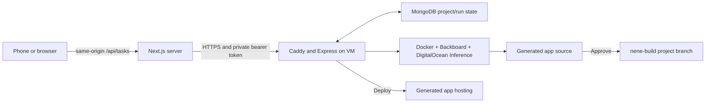

# ne-ne frontend

ne-ne is a mobile-friendly interface for building, reviewing, publishing and deploying applications with a cloud coding agent. This Next.js app proxies requests to the [ne-ne backend](https://github.com/DoanGiaHuyVu/nene-backend) from its server, keeping the backend API token out of browser JavaScript. Coding runs on the backend VM, so your laptop can turn off while a task continues.

This guide takes a new contributor from installing tools to local development, connecting a backend, checking the workflow, and hosting the frontend on Render. The backend README covers the separate Linux/Docker/MongoDB/model setup.

## Architecture



The frontend repository is **[DoanGiaHuyVu/nene-web](https://github.com/DoanGiaHuyVu/nene-web)**. `~/nene-frontend/nene-web` is the original local directory; it is not a repository named `nene-frontend`. Generated applications publish to the separate `nene-build` repository.

## Prerequisites

- Git, Node.js **22.x** and npm. `.node-version` contains `22`, and `package.json` requires `22.x`.
- A running compatible backend with `/tasks`, continuation, events, changes, approval and deployment routes.
- Its URL and matching `NENE_API_TOKEN`, obtained privately from the backend operator. They are not in Git.
- Internet access for dependencies and Google font downloads during production builds.
- GitHub access and a Render account only if you want to publish/host your own frontend.

Current package versions are Next.js `16.3.8`, React `19.2.8`, Tailwind CSS 4 and Sentry 11. Use the lockfile rather than installing a new template or independently upgrading packages. Running the frontend needs no local Docker, MongoDB, Backboard or DigitalOcean model key.

## Set up on your machine

### 1. Install Git and Node 22

On macOS, run `xcode-select --install` if Git is missing. On Ubuntu run `sudo apt update` then `sudo apt install git curl ca-certificates`. On Windows use the Git and Node 22 installers, or WSL2 Ubuntu for these shell commands.

Select version 22 from [Node.js downloads](https://nodejs.org/en/download). For macOS/Linux, [nvm](https://github.com/nvm-sh/nvm#installing-and-updating) is another option:

```sh
curl -fsSL https://raw.githubusercontent.com/nvm-sh/nvm/v0.40.8/install.sh -o /tmp/nene-nvm-install.sh
bash /tmp/nene-nvm-install.sh
. "$HOME/.nvm/nvm.sh"
nvm install 22
nvm use 22
git --version
node --version
npm --version
```

Reopen the terminal if nvm is unavailable. Node's version should begin with `v22.`. Avoid the historical Node 23 environment that caused engine warnings. Next.js/TypeScript are installed locally by the next step, not globally.

### 2. Clone the actual frontend repository

On your machine:

```sh
mkdir -p ~/nene-frontend
cd ~/nene-frontend
git clone https://github.com/DoanGiaHuyVu/nene-web.git
cd nene-web
npm ci
```

Run every remaining npm command from the directory containing `package.json`. The parent `~/nene-frontend` is not that directory. If a checkout already exists, inspect `git status` and use `git pull --ff-only` when safe; do not clone over it.

### 3. Configure a backend privately

```sh
cp .env.example .env.local
chmod 600 .env.local
```

Open `.env.local` in your editor and set:

```dotenv
NENE_BACKEND_URL=https://YOUR_BACKEND_HOST
NENE_API_TOKEN=the-matching-backend-token

# Optional: leave empty to disable Sentry.
SENTRY_DSN=
NEXT_PUBLIC_SENTRY_DSN=
SENTRY_ENVIRONMENT=development
NEXT_PUBLIC_SENTRY_ENVIRONMENT=development
```

Use a base URL with **no trailing slash** and no `/tasks` or `/api` suffix. Next.js automatically loads `.env.local`; you do not need to source it in your shell. Some route handlers validate configuration when imported, so supply both required variables before `npm run build` as well as before starting the server. Restart development after changing environment values.

Choose one connection:

| Backend location | `NENE_BACKEND_URL` | Notes |
| --- | --- | --- |
| Existing VM | `https://165-245-234-34.sslip.io` | Requires its privately supplied current token; submitting/approving/deploying affects real infrastructure |
| Separate Linux backend | `https://YOUR_BACKEND_HOST` | Complete the backend README first; use a separate database/credentials for development |
| Backend on the same machine | `http://127.0.0.1:3001` | Works only while a fully prepared backend is running there |
| VM accessed through SSH tunnel | `http://127.0.0.1:3001` | Tunnel command below; token still required |

For the tunnel, keep another terminal running:

```sh
ssh -N -L 3001:127.0.0.1:3001 nene@YOUR_VM_IP
```

This connects your machine's local port to the VM's private API; it does not copy or start another backend. If 3001 is already occupied, choose a different local port and adjust the URL. A hosted Render frontend cannot use a tunnel on your laptop or `localhost` to reach the VM; configure its public HTTPS URL.

Never name the token `NEXT_PUBLIC_NENE_API_TOKEN`, put it in components, or send it to the browser. The frontend needs only the URL and token; model, MongoDB, GitHub SSH and Render deployment credentials belong on the backend. `.env.local` is ignored; `.env.example` is the committed placeholder file. Check with `git check-ignore .env.local`.

### 4. Verify connection without creating a task

Public backend health:

```sh
curl -i https://YOUR_BACKEND_HOST/health
```

Expected: HTTP 200 and `{"ok":true,"service":"ne-ne"}`. For the existing VM, substitute its hostname. For a local backend/tunnel, use `http://127.0.0.1:3001/health`.

Start Next.js:

```sh
npm run dev
```

Open [http://localhost:3000](http://localhost:3000). In another terminal test the authenticated server-side proxy:

```sh
curl -i http://localhost:3000/api/tasks/00000000-0000-4000-8000-000000000000
```

Expected: HTTP 404 `Task not found`. This shows the proxy reached the backend and supplied a valid token without invoking the agent. HTTP 401 means token mismatch; 500/network errors usually mean missing configuration or an unreachable backend. Use a valid UUID: the older `/tasks/not-real` check now returns 400 after authentication.

The browser's Network panel should show same-origin `/api/tasks/...` requests, with no backend bearer token. Ctrl+C stops local Next.js. To stop the SSH tunnel, Ctrl+C its separate terminal. Cloud coding work already submitted continues on the backend.

### 5. Run checks and a production server

From the repository root:

```sh
npm test
npm run lint
npm run build
npm start
```

`npm test` checks project lifecycle, changes review and telemetry privacy using existing local suites; it does not launch a paid agent or deploy. `npm run lint` runs ESLint. Build checks compilation/types and requires configured environment values plus font-download connectivity. Stop `npm run dev` before starting production on the same port. `npm start` needs the `.next` output created by the build.

The default build uses Turbopack. If the host cannot open an internal worker port, try the supported webpack build:

```sh
npm run build -- --webpack
```

For an alternative production port/binding:

```sh
npm start -- --hostname 0.0.0.0 --port 3000
```

Next.js's official [environment guide](https://nextjs.org/docs/app/guides/environment-variables) explains private/server variables and build-time `NEXT_PUBLIC_` values. The [deployment guide](https://nextjs.org/docs/app/getting-started/deploying) covers Node server hosting. This app requires its server route handlers and cannot be deployed as a static export.

## Verify the product workflow

Run this against an installation you intend to use. It makes real model, GitHub and Render requests; keep initial prompts small.

1. Submit an app prompt, such as “Build a simple three-option restaurant voting app and run appropriate checks.” Confirm the UI reports planning, project creation, coding and testing as events arrive.
2. Wait for Ready for approval. Open **View Changes**; the initial run is labeled Initial build. Review files/patches before approval. Large/binary/omitted content and incomplete counts are labeled explicitly.
3. Click **Approve**. Publication must succeed before the run becomes completed. **View Code** should open the generated project's GitHub branch.
4. Click **Deploy**. Watch deployment progress; **Open App** becomes available when the backend reports `live`. Open the app and verify its behavior.
5. In the same project conversation, request an edit. It should load the latest approved project, show a diff against that source, then publish to the same GitHub branch after approval. **Deploy Update** should reuse the existing Render service/URL.
6. Reload the browser while a build is running. Stored project history should restore and status/SSE/polling should catch up. Failed updates should keep the last successful code/live URL and allow retry.
7. Once both frontend and backend are hosted, repeat from a phone with the laptop disconnected. A local Next.js server disappears when the laptop shuts down; the hosted frontend is required for the complete phone experience.

The Testing stage is inferred from agent events, not an independent guarantee that every generated-app test succeeded. Inspect changes and deployment behavior. Approval and deployment remain separate actions.

## Project conversations and storage

Home groups revisions into projects with stable titles, request/result history, approvals, publication links and deployment results. The composer stays visible; a follow-up can be sent after published code is available and the current build/approval/deployment action has finished. Failed edits can retry against the latest successful published revision.

Conversation history lives in this browser's `localStorage` under **`nene-projects-v1`**. Legacy `nene-task-id` is imported when available. Clearing browser data removes the local conversation list, and history does not sync between browsers/devices. The backend persists project ownership and individual runs, but has no listing API for rebuilding all conversations on a fresh browser. The same origin/browser profile must be used for local restoration.

The last published branch/commit and live URL remain visible during updates or failures. An inherited live URL does not mean the new revision is deployed. Changes are fetched lazily, rendered as text and discarded on closing/navigating/new runs; diff contents are not persisted in browser history. Approve stays separate from review.

The historical documents call the UI a PWA. This checkout implements a mobile-friendly web app, but has no app manifest/service worker or verified offline support. Do not assume offline operation or installability. It also has no user login/access-control layer: its server proxy holds a shared privileged backend token. Limit access to intended users before treating a public deployment as a multi-user service.

## Repository map

```text
nene-web/
├── app/
│   ├── page.tsx                    # home, project conversations, lifecycle UI
│   ├── layout.tsx                  # root layout and Geist fonts
│   ├── globals.css                 # shared styling
│   ├── global-error.tsx            # error boundary
│   ├── components/changes-panel.tsx
│   ├── lib/
│   │   ├── projects.ts             # browser history and lifecycle helpers
│   │   ├── changes.ts              # review fetch/types
│   │   └── observability.ts        # bounded API error reporting
│   └── api/tasks/
│       ├── route.ts                # POST create
│       └── [id]/
│           ├── route.ts            # GET state
│           ├── events/route.ts     # SSE proxy
│           ├── changes/route.ts    # review proxy
│           ├── continue/route.ts   # follow-up proxy
│           ├── approve/route.ts    # publish proxy
│           └── deploy/route.ts     # Render deployment proxy
├── tests/                          # lifecycle, review and privacy regressions
├── public/                         # static assets
├── instrumentation.ts              # server/edge telemetry hooks
├── instrumentation-client.ts       # browser telemetry hook
├── sentry.*.ts                     # telemetry configuration/privacy
├── next.config.ts
├── .env.example
├── .node-version                   # Node 22
├── package.json
└── package-lock.json
```

Every frontend `/api/tasks` route mirrors a backend `/tasks` route and attaches the bearer token on the server. Events stream through Next.js to browser `EventSource`; polling also recovers missed state and monitors asynchronous deployments. The current events proxy does not forward `Last-Event-ID`; do not assume incremental cursor replay through it even though direct backend SSE supports cursors.

## Deploy the frontend to Render

The frontend and generated applications are different services. This frontend uses the **Node runtime**. Generated applications use their generated **Dockerfile**, deployed by the backend.

1. Push this app to a GitHub repository you control, or obtain access to `DoanGiaHuyVu/nene-web`.
2. Create a Render **Web Service** connected to that repository. Do not choose Static Site: private server route handlers must execute.
3. Set the following fields. Consult [Render's Next.js guide](https://render.com/docs/deploy-nextjs-app) and [Node version settings](https://render.com/docs/node-version).

| Setting | Value |
| --- | --- |
| Branch | `main`, or the branch you intend to host |
| Root directory | Empty for this repository; `nene-web` only if you actually use a parent repository containing it |
| Runtime | Node |
| Node version | `22.x` via committed `.node-version`/`package.json`; ensure no conflicting dashboard `NODE_VERSION` |
| Build command | `npm ci && npm run build` |
| Start command | `npm start -- --hostname 0.0.0.0 --port $PORT` |
| `NENE_BACKEND_URL` | Public backend HTTPS base URL, no trailing slash |
| `NENE_API_TOKEN` | Same private value as backend |
| Optional Sentry variables | DSNs/environments listed below |

4. Set environment variables **before the initial build**. Render does not receive your local ignored `.env.local`.
5. Deploy and inspect logs. The server must bind to `0.0.0.0` and Render's assigned port. The start command above makes this explicit.
6. Open the assigned `onrender.com` URL. Repeat the synthetic UUID `/api/tasks/...` lookup (expect 404), then the intended full workflow.
7. Enable auto-deploy from your selected branch if desired. Later environment changes require a restart/redeploy; browser-visible `NEXT_PUBLIC_` changes require rebuilding.

The inspected existing service on **October 5, 2026** is `nene`, [nene-5yh0.onrender.com](https://nene-5yh0.onrender.com), Node runtime, Oregon, repository `DoanGiaHuyVu/nene-web`, root empty, branch `main`, auto-deploy on commit. Its current commands are `npm install; npm run build` and `npm run start`. Read-only page/proxy checks returned 200/404. The table above recommends reproducible installation and explicit port binding for new services; it does not claim the existing settings were changed.

If a public URL has a cold start, allow time for the hosting plan to wake. Verify current hosting limits before relying on persistent uptime.

## Optional Sentry monitoring

| Variable | Purpose |
| --- | --- |
| `SENTRY_DSN` | Private server/edge runtime DSN; empty disables it |
| `NEXT_PUBLIC_SENTRY_DSN` | Browser ingestion DSN; public by design |
| `SENTRY_ENVIRONMENT` | Server environment label |
| `NEXT_PUBLIC_SENTRY_ENVIRONMENT` | Browser environment label, embedded at build |

Use your project's DSN, not a Sentry API auth token. The browser DSN is an ingestion address; backend authentication credentials must remain private. Both `NEXT_PUBLIC_` fields above are build-time browser values.

The frontend captures browser/rendering/server errors and unexpected API failures. Privacy filters remove prompts, code, request/user data, console breadcrumbs and stack source context. Expected 4xx/cancelled requests are excluded; repeated API failures are capped at five per route category per 15 minutes. Performance tracing, replay and source-map uploads are disabled in this setup. See [backend Sentry setup and agent traces](https://github.com/DoanGiaHuyVu/nene-backend/blob/main/docs/SENTRY-AGENT-TRACING.md).

## Updating and troubleshooting

Inspect `git status`, pull with `git pull --ff-only` when appropriate, then `npm ci`, `npm test`, `npm run lint` and `npm run build`. Commit only intended changes and push the hosted branch. With auto-deploy enabled, Render rebuilds the frontend. GitHub push does not update backend files on the VM. Deploy backend support for `/tasks/:id/changes` before shipping a UI that depends on it.

| Symptom | Check / fix |
| --- | --- |
| Missing package.json / npm fails from parent directory | `cd` into `nene-web`, not `nene-frontend` |
| Engine warnings | Select Node 22; check conflicting hosting version overrides |
| Missing backend URL/token during build | Create `.env.local` locally or set Render variables before building |
| 401 via proxy | Exact same token as backend; restart Next.js/redeploy after changes |
| Network error / Render 502 | Public backend health, Caddy, host connectivity; no localhost backend URL on Render |
| Unexpected doubled paths | Base URL without trailing slash, `/api` or `/tasks` suffix |
| 400 for `not-real` | Backend validates UUIDs; use the synthetic UUID above |
| 409 during submit/update | Backend worker/project lock; wait for current work or approve the pending revision |
| Stalled progress | Inspect events request/polling and backend status; proxies must allow long-lived SSE |
| View Changes error | Compatible backend installed; recorded artifacts/baseline available; retry the panel |
| Missing conversation after browser change | Browser-local storage is not synchronized; origin/profile/data clearing matters |
| Build font-download failure | Permit outbound Google font access; this layout uses `next/font/google` |
| Turbopack worker-port failure | Try `npm run build -- --webpack` in an environment allowing build workers |
| `npm start` has no production build | Run `npm run build` first; retain `.next` |
| Deploy does not become live | Backend Render configuration and generated app build logs; separate from hosting this frontend |

## Corrections to the historical process notes

The seven process documents describe earlier stages. Current source and live configuration take precedence:

- Clone `nene-web`; do not generate another `create-next-app` project to install the existing system.
- Use Node 22 and `npm ci`, replacing the historical Node 23/npm-install setup for reproducibility.
- Approve now publishes to GitHub before completion; Deploy is implemented, not a disabled future feature.
- Projects contain multiple revisions. Approved follow-ups reuse the project's GitHub branch and Render service.
- Conversation storage is `nene-projects-v1`; the earlier single-task `nene-task-id` is imported only as legacy data.
- Backend project/run state survives restarts, but the frontend conversation list still does not sync to a new browser.
- Keep the token server-only and use a Web Service, not static hosting. A local frontend must stay running; a hosted one enables the laptop-off phone experience.
- View Changes and optional Sentry monitoring were added after the original process notes.
- PWA/offline support should not be claimed from the current checkout.

Documentation verification on October 5, 2026 used Node 22.23.3: all 13 tests and lint passed, and `npm run build -- --webpack` produced a successful production build. The default Turbopack build hit this environment's worker-port restriction. A temporary production frontend returned homepage 200 and the authenticated synthetic lookup 404. Shell examples and local links were checked. The hosted service was inspected with read-only requests; no new paid coding/publication/deployment workflow was launched for this documentation update.
